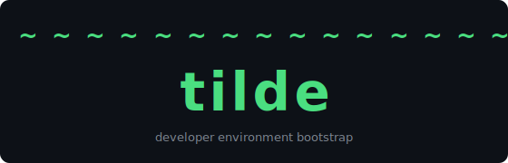

<div align="center">
  

  [](https://github.com/jwill824/tilde/actions/workflows/ci.yml)
  [](https://github.com/jwill824/tilde/actions/workflows/release.yml)
  [](https://www.npmjs.com/package/@jwill824/tilde)
  [](https://www.npmjs.com/package/@jwill824/tilde)
  [](https://github.com/jwill824/tilde/releases)
  [](https://nodejs.org)
  [](https://www.npmjs.com/package/@jwill824/tilde)
  [](https://github.com/semantic-release/semantic-release)
  [](https://opensource.org/licenses/MIT)
</div>

> Bootstrap your developer environment on macOS, Windows, and Linux with a single command.

**tilde** is an interactive CLI built with [Ink](https://github.com/vadimdemedes/ink) that guides you through setting up a complete developer environment from scratch — or restores one you've already defined. It handles everything from shell configuration and package installation to multi-account GitHub identity switching and context-aware environment variables.

```bash
npx @jwill824/tilde
```

> **Coming soon:** `curl -fsSL https://thingstead.io/tilde/install.sh | bash` — a one-liner installer for fresh machines with no Node.js prerequisite ([#4](https://github.com/jwill824/tilde/issues/4)).

---

## Features

- **Interactive wizard** — top-down setup: shell → package manager → version manager → languages → workspace → contexts → git auth → tools → configurations → accounts → secrets
- **Config-first restore** — save your choices to `tilde.config.json` and replay them on any future machine with zero re-prompting
- **Multi-account GitHub** — auto-switch `gh` CLI account when you `cd` into a context directory
- **Context-aware git identity** — gitconfig `includeIf` blocks auto-apply the right `user.name`/`user.email` per workspace folder
- **Environment capture** — scans your existing `~`, `brew list`, and RC files to pre-populate wizard defaults
- **Idempotent** — safe to re-run; skips anything already correctly configured
- **Checkpoint/resume** — interrupted mid-wizard? Pick up where you left off
- **Plugin architecture** — every integration category (package manager, secrets backend, version manager, account connector) is a swappable plugin
- **Dry-run mode** — preview all planned changes before applying them

---

## Quick Start

### Prerequisites

tilde requires **Node.js 20+** to run — but only temporarily on a fresh machine. The wizard will install your chosen version manager (vfox, nvm, etc.) and the proper Node.js runtime through it. Once setup completes, tilde will offer to remove the bootstrap Node.js installation to keep your system clean.

**Step 1 — Install a bootstrap Node.js (one-time only):**

```bash
# Have Homebrew? (https://brew.sh)
brew install node

# No Homebrew yet? Download Node.js directly (installs to /usr/local):
# → https://nodejs.org/en/download
```

> Verify: `node --version` should print `v20.x.x` or higher.

**Step 2 — Run tilde:**

```bash
npx @jwill824/tilde
```

The wizard sets up your environment — including Homebrew, your version manager, and Node.js — then offers to clean up the temporary Node.js installation it used to bootstrap.

> **Note:** The automatic cleanup step is [coming soon](https://github.com/jwill824/tilde/issues/2). Until then, uninstall manually: `brew uninstall node` or remove the nodejs.org pkg via System Preferences → Uninstall.

### Option 1 — Run without installing (recommended)

```bash
npx @jwill824/tilde
```

No global install needed — always pulls the latest version.

### Option 2 — Install globally via npm

```bash
npm install -g @jwill824/tilde
tilde
```

### Coming soon

- **`brew install tilde`** — Homebrew formula ([#3](https://github.com/jwill824/tilde/issues/3))
- **`curl -fsSL https://thingstead.io/tilde/install.sh | bash`** — zero-prereq one-liner for fresh machines ([#4](https://github.com/jwill824/tilde/issues/4))
- **pnpm / yarn** global install support ([#5](https://github.com/jwill824/tilde/issues/5))

### Restore from a saved config

```bash
tilde install --config ~/path/to/tilde.config.json
```

### Non-interactive (CI / scripted)

```bash
tilde install --config tilde.config.json --yes
```

---

## Commands

```
tilde [install] [options]      Run the wizard or apply a saved config

Options:
  --config <path>    Load tilde.config.json (activates config-first mode)
  --yes, --ci        Non-interactive mode (requires --config)
  --dry-run          Print planned actions without executing
  --resume           Resume from last checkpoint
  --reconfigure      Re-run wizard over an existing config
  --version, -v      Show version
  --help, -h         Show help
```

### Subcommands

```
tilde context list              List all configured contexts
tilde context current           Show active context based on $PWD
tilde context switch <label>    Manually switch to a context

tilde plugin list               List registered plugins
tilde plugin add <name>         Install a community plugin (tilde-plugin-<name>)
tilde plugin remove <name>      Remove a community plugin

tilde config validate [path]    Validate a tilde.config.json
tilde config show [path]        Pretty-print active config
tilde config edit               Open config in $EDITOR
```

---

## How It Works

### 1. Wizard (prompt-first)

The wizard walks through 14 steps, using `<Static>` to lock completed steps above the current prompt:

```
Step 00  Detect existing config
Step 01  Scan current environment (optional)
Step 02  Shell selection
Step 03  Package manager
Step 04  Version manager(s)
Step 05  Languages & versions
Step 06  Workspace root & dotfiles repo path
Step 07  Define contexts (personal / work / client …)
Step 08  Git auth method per context
Step 09  Additional tools (Homebrew formulae)
Step 10  App configurations (git, vscode, aliases, OS defaults)
Step 11  GitHub account usernames
Step 12  Secrets backend (1Password / Keychain / env-only)
Step 13  Review, confirm, and export tilde.config.json
```

### 2. Config-first

Pass `--config` with a previously generated `tilde.config.json` and tilde skips straight to a summary screen, confirms once, then applies everything in the same order as the wizard.

### 3. Context-aware switching

After setup, your `.zshrc` contains a managed `cd()` function that auto-switches the active `gh` account when you enter a context directory:

```zsh
# --- tilde:cd-hook:begin ---
function cd() {
  builtin cd "$@"
  case "$PWD" in
    *Developer/work*)     gh auth switch --user work-username 2>/dev/null ;;
    *Developer/personal*) gh auth switch --user personal-username 2>/dev/null ;;
  esac
}
# --- tilde:cd-hook:end ---
```

Git identity resolves automatically via `~/.gitconfig` `includeIf` blocks — no extra tooling required.

---

## tilde.config.json

Your environment as code. Generated by the wizard, re-applied by `--config`.

```json
{
  "$schema": "https://tilde.sh/config-schema/v1.json",
  "version": "1",
  "os": "macos",
  "shell": "zsh",
  "packageManager": "homebrew",
  "versionManagers": [{ "name": "vfox" }],
  "languages": [
    { "name": "node", "version": "22.0.0", "manager": "vfox" }
  ],
  "workspaceRoot": "~/Developer",
  "dotfilesRepo": "~/Developer/personal/dotfiles",
  "contexts": [
    {
      "label": "personal",
      "path": "~/Developer/personal",
      "git": { "name": "Your Name", "email": "you@example.com" },
      "github": { "username": "your-username" },
      "authMethod": "gh-cli",
      "envVars": []
    },
    {
      "label": "work",
      "path": "~/Developer/work",
      "git": { "name": "Your Name", "email": "you@company.com" },
      "github": { "username": "work-username" },
      "authMethod": "gh-cli",
      "envVars": [
        { "key": "AWS_PROFILE", "value": "op://Work/AWS/profile" }
      ]
    }
  ],
  "tools": ["ripgrep", "fzf", "bat", "jq"],
  "configurations": {
    "git": true,
    "vscode": false,
    "aliases": false,
    "osDefaults": false,
    "direnv": true
  },
  "secretsBackend": "1password"
}
```

Secrets are never stored in plain text — use `op://vault/item/field` references for 1Password or equivalent backend format. See [`docs/config-format.md`](docs/config-format.md) for the full schema reference.

---

## Plugins

Every integration point is a swappable plugin implementing one of five interfaces:

| Interface | First-party | Purpose |
|-----------|-------------|---------|
| `PackageManagerPlugin` | Homebrew | Install packages |
| `VersionManagerPlugin` | vfox | Install language runtimes |
| `AccountConnectorPlugin` | gh-cli | Switch GitHub accounts |
| `SecretsBackendPlugin` | 1Password | Generate secret references |
| `EnvLoaderPlugin` | direnv | Per-directory env vars |

Install a community plugin:

```bash
tilde plugin add my-tool   # installs npm package tilde-plugin-my-tool
```

---

## Environment Variables

| Variable | Description |
|----------|-------------|
| `TILDE_CONFIG` | Path to `tilde.config.json` (same as `--config`) |
| `TILDE_STATE_DIR` | Override checkpoint/state directory (default `~/.tilde`) |
| `TILDE_CI` | Set to `1` for non-interactive mode (same as `--yes`) |
| `TILDE_NO_COLOR` | Set to `1` to disable color output |

---

## Exit Codes

| Code | Meaning |
|------|---------|
| `0` | Success |
| `1` | General error |
| `2` | Config schema validation failure |
| `3` | Missing required field in CI mode |
| `4` | Plugin error |
| `5` | User cancelled |

---

## Requirements

- macOS (Apple Silicon — arm64) · Windows · Linux
- Node.js 20+ (installed automatically by `bootstrap.sh` if absent)

---

## Website & Docs

| URL | Description |
|-----|-------------|
| [thingstead.io/tilde](https://thingstead.io/tilde) | Landing page — curl install hero, install method cards |
| [thingstead.io/tilde/docs](https://thingstead.io/tilde/docs) | Full documentation — installation, getting started, config reference |

The site source lives in `site/tilde/` (landing page + install script) and `site/docs/` (Astro + Starlight docs). See [CONTRIBUTING.md](CONTRIBUTING.md#site-development) for local preview and deployment details.

---

## Contributing

Want to fix a bug, add a plugin, or improve the wizard? See [CONTRIBUTING.md](CONTRIBUTING.md).

### Development workflow (speckit)

tilde uses a spec-driven development workflow. Every feature follows the pipeline:

```
specify → clarify → plan → tasks → analyze → implement
```

No code may be written for a new feature until `tasks.md` exists and `/speckit.analyze` passes. For the full command reference, constitution principles, and contribution workflow, see [CONTRIBUTING.md](CONTRIBUTING.md).

## License

